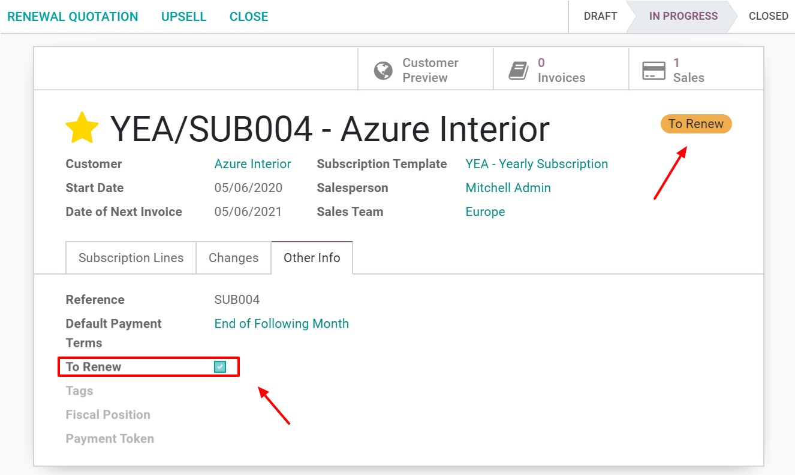

====================
Renew a subscription
====================

The key feature of a subscription business model is the recurring nature of payments. In this model,
customers pay a recurring amount in exchange for access to a product or a service.

.. raw:: html

   
 <b>The renewal of a
   subscription is the process followed by each customer when willing to pursue a
   subscription.</b> 

Each subscriber experiences this renewal process monthly, annually or sometimes more, depending on
the duration of the contract. Most subscription companies choose to automate their renewal
processes, but in some cases, manual subscription renewals are still the preferred option.

With **Odoo Subscriptions**, you can have all your subscriptions in one application, suggest to your
customers an automatic subscription renewals as a manual one and finally, filter all your
subscriptions and easily find those to renew (with the help of the tag *To renew*).

Renew your first subscription
=============================

Before renewing a subscription, be sure to check out our documentation on how to create a quotation
using subscription products, :doc:`../../subscriptions/sales_flow/create_a_quotation`. Indeed,
once confirmed, a quotation becomes a sales order and, a new subscription is automatically created.
This subscription will therefore have the status *In progress*. From there, you have the
possibility to renew the subscription. In the Other Info tab, underneath the To Renew section, you
can activate the *To renew* option. When activated, a yellow tag will automatically appear in the
upper right corner of the subscription.

.. important::
   The *To renew* tag is automatically ticked when a payment fails. This indicator also appears
   on the customer portal. To visualize that, you just have to click on the intelligent button
   *Customer preview*. The tag *To renew* will be at the top right corner.

   .. image:: media/renewals_2.png
     :align: center
     :alt: Customer preview of a renewal with Odoo Subscriptions

When a subscription needs to be renewed, you have the possibility to use a new button called
*Renewal quotation*. By clicking on this button, a new quotation will be created. From there, you
will encounter a basic sales flow allowing you to send the quotation by email to your customers or
to confirm it. It is better to first *Send by email* the quotation to your customers in order to
have their confirmation and then *Confirm* your quotation in **Odoo Sales**.

.. note::
   In the Chatter of this new quotation, it is mentioned that "This renewal order has been created
   from the previous subscription". Once confirmed by your customers, this quotation will become a
   sales order and, one new sales will be mentioned in the upper right corner of the subscription.

   .. image:: media/renewals_3.png
     :align: center
     :alt: Renew a quotation with Odoo Subscriptions

   By clicking on the intelligent button *Sales*, you will have a summary of your sales orders in a
   list view. The only difference here between your two quotations is the description underneath the
   category *Subscription Management*. There, you can easily visualize which one is your renewal.

   .. image:: media/renewals_4.png
     :align: center
     :alt: Renewal as Subscription Management form in Odoo Subscriptions

Visualize your subscriptions to renew
=====================================

Finally, if you want to visualize all your subscriptions and easily find those to renew, you can go
to your *Subscriptions dashboard* and use the filter *To renew*.

.. image:: media/renewals_5.png
  :align: center
  :alt: List view of all subscriptions and use of the filter to renew in Odoo Subscriptions

.. seealso::
  - :doc:`../../subscriptions/configuration/subscription_templates`
  - :doc:`../../subscriptions/configuration/subscription_products`
  - :doc:`../../subscriptions/sales_flow/create_a_quotation`
